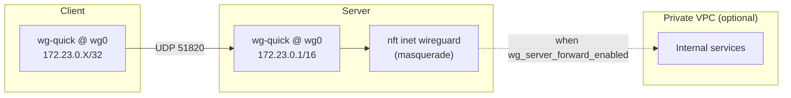

# Wireguard VPN Demo

Ansible playbooks to bring up a WireGuard VPN: one server accepting many clients.
Each side is configured by an Ansible role.

## Architecture



- Tunnel network: `172.23.0.0/16` (server at `172.23.0.1`).
- Listen port: `UDP 51820`.
- Forwarding into a downstream VPC is off by default; flip the
  `wg_server_forward_*` vars to turn it on (see below).

## Repo layout

```
ansible.cfg                  # roles_path + local-friendly defaults
inventory/hosts.yml          # localhost via ansible_connection=local
peers.yml                    # the VPN's peer registry (PR target)
playbooks/
  ping.yml                   # smoke test
  server.yml                 # invokes the wg_server role
  client.yml                 # invokes the wg_client role
roles/
  wg_server/                 # install -> keys -> nft -> conf -> service
  wg_client/                 # install -> keys -> conf -> service -> print pubkey
```

## Setup — Server

On the Server:

```sh
ansible-playbook playbooks/server.yml --ask-become-pass
```

The play installs `wireguard-tools`, generates `/etc/wireguard/privatekey`
+ `publickey` if absent, renders `/etc/wireguard/wg0.conf` from
`peers.yml`, and enables `wg-quick@wg0.service`. Share the contents of
`/etc/wireguard/publickey` with clients — they need it for their client
config.

## Setup — Client

On the client, provide three things and run:

```sh
ansible-playbook playbooks/client.yml --ask-become-pass \
  -e wg_client_address=172.23.0.2 \
  -e wg_server_public_key='<server pubkey>' \
  -e wg_server_endpoint='dev.example.com:51820'
```

- `wg_client_address` — your assigned tunnel address (from the `peers` vars)
- `wg_server_public_key` — copy from `/etc/wireguard/publickey` on the server.
- `wg_server_endpoint` — the server's reachable `host:port`.

The play generates a keypair if absent, configures `wg0`, starts the
service, and prints your **public key** at the end. Send that pubkey to
the admin (e.g. via PR — see next section).

## Adding a peer

1. Run `playbooks/client.yml` locally; the play prints your public key.
2. Add entry to `peers.yml`:
   ```yaml
   wg_server_peers:
     - name: <USER>
       public_key: <BASE64_PUBKEY>
       address: 172.23.0.123
   ```
   Pick the next unused address in `172.23.0.0/16`. The server playbook
   asserts uniqueness across all peers and refuses to apply if two
   addresses collide.
3. Run `ansible-playbook playbooks/server.yml` on the server to configure peering.

## Enabling forwarding to a downstream network

To let connected clients reach hosts beyond the server (e.g. a private VPC), add a `vars:` block to `playbooks/server.yml`:

```yaml
  vars:
    wg_server_forward_enabled: true
    wg_server_forward_egress_iface: eth0
```

The server will persist `net.ipv4.ip_forward=1`, render
`/etc/wireguard/forward.up.nft`, and add `PostUp`/`PostDown` lines to
`wg0.conf` so the `inet wireguard` nftables table loads on tunnel up and
flushes on tunnel down (MASQUERADE out of `wg_server_forward_egress_iface`).

Clients that want traffic for the downstream CIDR routed through the
tunnel must include it in their `wg_client_allowed_ips` — for example:

```yaml
wg_client_allowed_ips:
  - 172.23.0.0/16
  - 10.0.0.0/16   # the VPC CIDR
```
